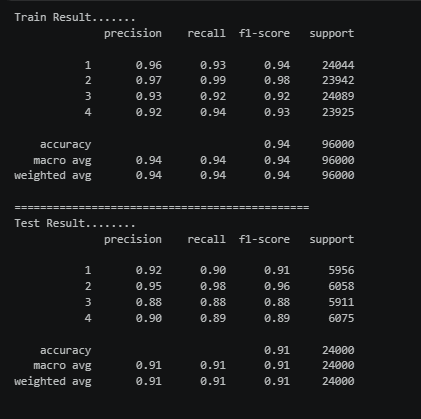
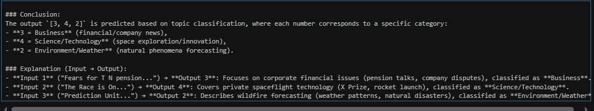

# 📰 AG News Classification using Machine Learning

<div align="center">


### 🚀 News Category Prediction using Natural Language Processing

</div>

---

# 📖 Project Overview

This project implements a **Machine Learning-based News Classification System** that automatically predicts the category of a news article using its **Title** and **Description**.

The project uses **Natural Language Processing (NLP)** techniques with **TF-IDF Vectorization** and **Logistic Regression** to classify news articles into predefined categories.

The trained model is saved using **Joblib** and later loaded to predict the category of new articles.

---

# 🎯 Objective

Build a robust text classification model capable of automatically categorizing news articles based on textual content.

---

# 📂 Project Structure

```text
AG_News_Analysis/
│
├── AG_News.ipynb          # Model Training
├── AGNews_Pred.ipynb      # Prediction Notebook
├── AG_News.csv            # Dataset
├── AG_News.pkl            # Trained Model
├── README.md
└── requirements.txt
```

---

# 📊 Dataset

The dataset contains news articles with:

* News Title
* News Description
* Category Label

A new feature named **Text** is created by combining the Title and Description before training the model.

---

# ⚙️ Machine Learning Workflow

```text
Dataset
    │
    ▼
Data Cleaning
    │
    ▼
Text Combination
(Title + Description)
    │
    ▼
Train-Test Split
    │
    ▼
TF-IDF Vectorization
    │
    ▼
Logistic Regression
    │
    ▼
Model Evaluation
    │
    ▼
Save Model (.pkl)
    │
    ▼
Prediction on New Articles
```

---

# 🧠 Technologies Used

* Python
* Pandas
* Scikit-learn
* Joblib
* Jupyter Notebook

---

# 📚 Machine Learning Pipeline

The model is built using Scikit-learn Pipeline.

### Step 1

Train-Test Split

### Step 2

TF-IDF Vectorization

### Step 3

Logistic Regression Model

### Step 4

Model Evaluation

### Step 5

Model Serialization using Joblib

---

# 🤖 Algorithm Used

## Logistic Regression

Logistic Regression is a supervised machine learning algorithm widely used for text classification.

It is efficient, fast, and performs well when combined with TF-IDF features.

---

# 📝 Text Preprocessing

The project performs:

* Combining Title and Description
* TF-IDF Vectorization
* Feature Transformation
* Numeric Representation of Text

---

# 📈 Model Evaluation

The trained model is evaluated using:

* Classification Report
* Precision
* Recall
* F1 Score
* Training Performance
* Testing Performance

  # 📊 Model Performance

The Logistic Regression model achieved excellent performance on the AG News dataset.

## Training Performance

<p align="center">
  
</p>

### Highlights

- ✅ Training Accuracy: **94%**
- ✅ Testing Accuracy: **91%**
- ✅ Macro F1-Score: **91%**
- ✅ Weighted F1-Score: **91%**

---

# 🔮 Prediction Workflow

```text
Input News
     │
     ▼
TF-IDF Transformation
     │
     ▼
Load Saved Model
     │
     ▼
Prediction
     │
     ▼
News Category
```

---

# 💻 Installation

Clone the repository

```bash
git clone https://github.com/SachinDevarajan/AG_News_Analysis.git
```

Move to project

```bash
cd AG_News_Analysis
```

Install dependencies

```bash
pip install pandas scikit-learn joblib notebook
```

---

# ▶️ Run the Project

Train the model

```bash
jupyter notebook AG_News.ipynb
```

Predict new articles

```bash
jupyter notebook AGNews_Pred.ipynb
```

---

# 📸 Sample Prediction

# 📰 Sample Predictions

The trained model successfully predicts the category of unseen news articles.

<p align="center">
  
</p>

---

# 🚀 Future Improvements

* Hyperparameter Tuning
* Support Vector Machine (SVM)
* Naive Bayes Comparison
* Random Forest Comparison
* XGBoost
* Deep Learning (LSTM/BERT)
* Streamlit Web Application
* Flask API Deployment

---

# 📌 Key Features

* ✅ NLP-based Text Classification
* ✅ TF-IDF Vectorization
* ✅ Logistic Regression
* ✅ Scikit-learn Pipeline
* ✅ Model Serialization with Joblib
* ✅ Fast Prediction
* ✅ Easy to Extend

---

# 🛠 Skills Demonstrated

* Machine Learning
* Natural Language Processing
* Text Classification
* Feature Engineering
* TF-IDF
* Logistic Regression
* Model Evaluation
* Python
* Scikit-learn
* Pandas

---

# 🤝 Contributing

Contributions are welcome!

1. Fork the repository
2. Create a new branch
3. Commit your changes
4. Push your branch
5. Open a Pull Request

---

# 👨‍💻 Author

## Sachin Devarajan

**Data Analyst | Machine Learning Enthusiast**

* 💼 Passionate about Data Analytics, Machine Learning, and NLP
* 📊 Building practical AI and analytics projects
* 🌱 Continuously learning advanced Machine Learning and Data Engineering

---

<div align="center">

## ⭐ If you found this project useful, please give it a Star!

**"Turning text into intelligent predictions through Machine Learning."**


</div>
